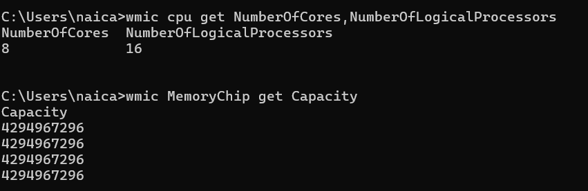
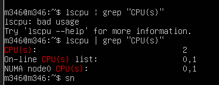
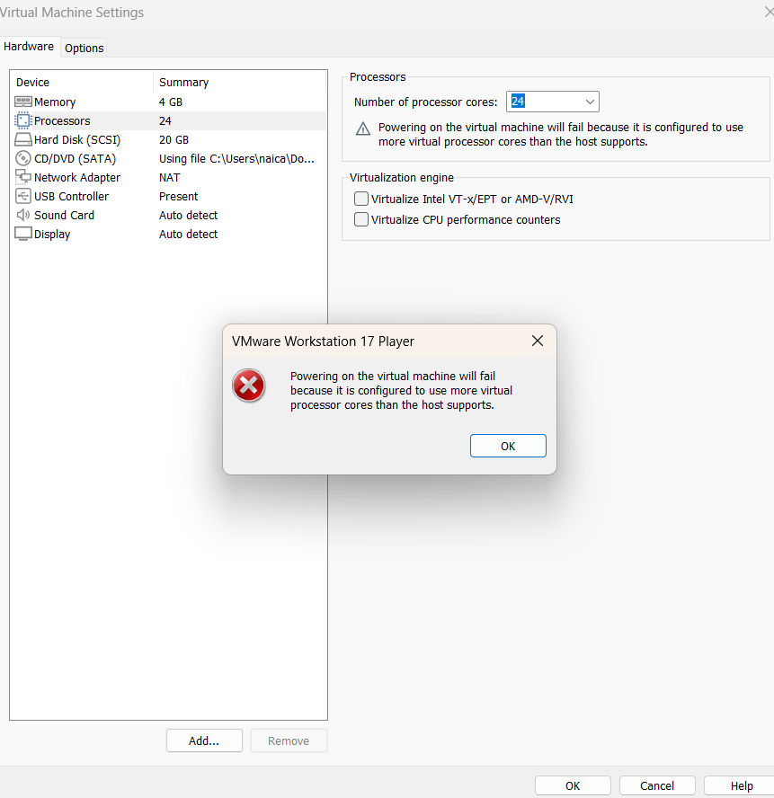
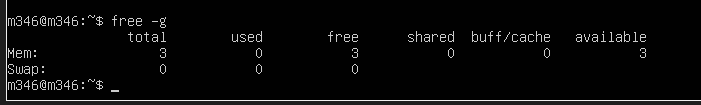
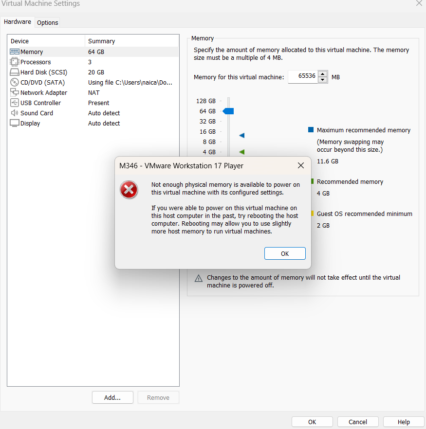

# Kompetenznachweis

Host System Logische Prozessoren und RAM 

Screenshot mit der Konsolen-Ausgabe der CPUs bei weniger CPU als Ihr Host-System hat. 

Screenshot mit der Konsolen-Ausgabe der CPUs (oder Fehlermeldung des Host-Systems) bei
mehr CPU als Ihr Host-System hat. 

Screenshot mit der Konsolen-Ausgabe des RAM bei weniger RAM als Ihr Host-System hat. 

Screenshot mit der Konsolen-Ausgabe der RAM (oder Fehlermeldung des Host-Systems) bei
mehr RAM als Ihr Host-System hat. 

Erklärung wieso Sie Fehlermeldungen kriegen oder Erklärung wie es möglich ist, dass Sie
mehr Ressourcen zuteilen können als Ihr Host-System hat. Machen Sie sinnvolle
Überlegungen! 
Ich bekomme die Fehlermeldung, dass es nicht möglich ist mehr Ressourcen zuteilen zu können weil ich nicht so viel RAM unnd CPU habe auf meinem Laptop. Es wäre jedoch möglich, mehr zuzuteilen wenn ich Typ 2 hätte. Bei Typ-2 Hypervisoren, die auf einem bestehenden Betriebssystem laufen, ist es möglich, mehr virtuelle Ressourcen zuzuweisen, als physisch verfügbar sind. Dies geschieht, indem Ressourcen dynamisch verteilt werden. Diese Technik hat jedoch Grenzen, und wenn diese überschritten werden, wird eine Fehlermeldung ausgegeben. Selbst bei Überprovisionierung ist die Gesamtleistung dadurch beeinträchtigt.
