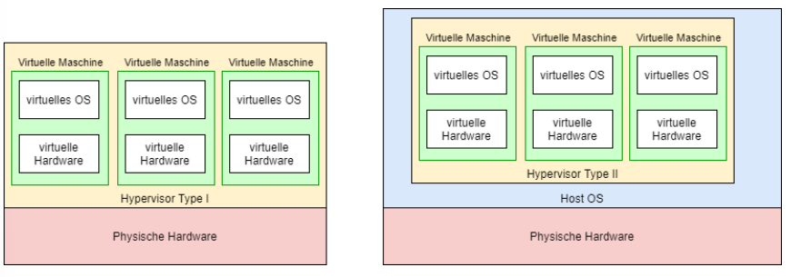
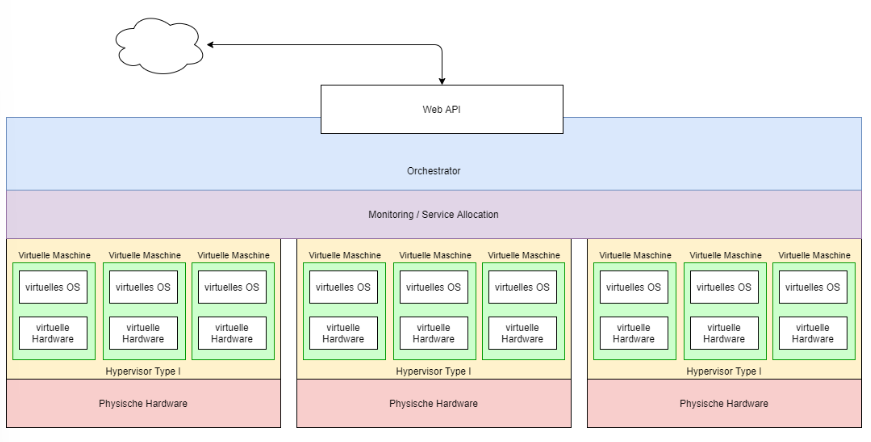
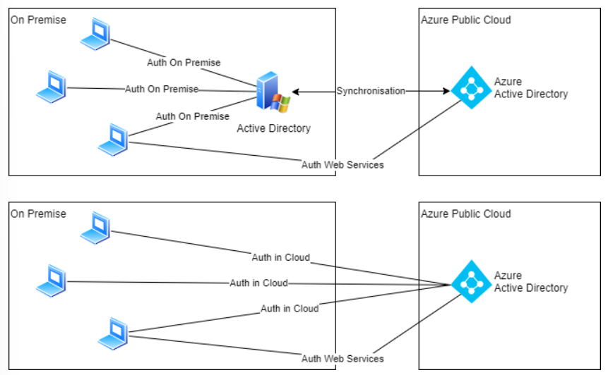

# Virtualisierung

## Explination
A hypervisor is a process that separates the operating system and applications from the underlying physical hardware. This is typically done through software, although embedded hypervisors can also be created, such as those found in mobile devices.

## 2 Types of Hypervisors
Type  1 native
Runs directly on the hardware of the host system. This variant is more common.

Type 2 hosted
Runs as an application on the operating system (OS) and uses the OS processes. It allows more resources to be allocated than are available on the hardware. The OS system parallelizes the processes and stores RAM on the hard disk.

## Hyperscaler
Large cloud service providers that can offer services such as computing and storage at an enterprise scale. They get their name from hyperscale computing, which is a method of processing data that allows software architecture to scale and grow as increased demand is added to the system.

## Betriebsmodelle
- On Premise
All hardware and software are operated in owned or rented data centers.

- Hybrid Cloud
Sometimes the servers and applications are on-premise, and sometimes they are in the cloud. Today, this model is the most common. For example, when a company uses Office 365 licenses, some parts are in the cloud.

- Cloud Native
In this model, the entire infrastructure and all applications are in the cloud.

Cloud operating models can additionally be categorized as public cloud or private cloud. A public cloud is, for example, Azure and AWS, while a private cloud could be a company's own cloud infrastructure.

