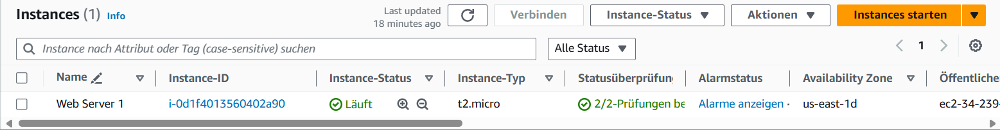
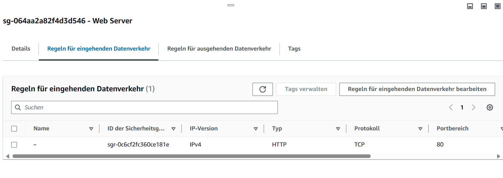
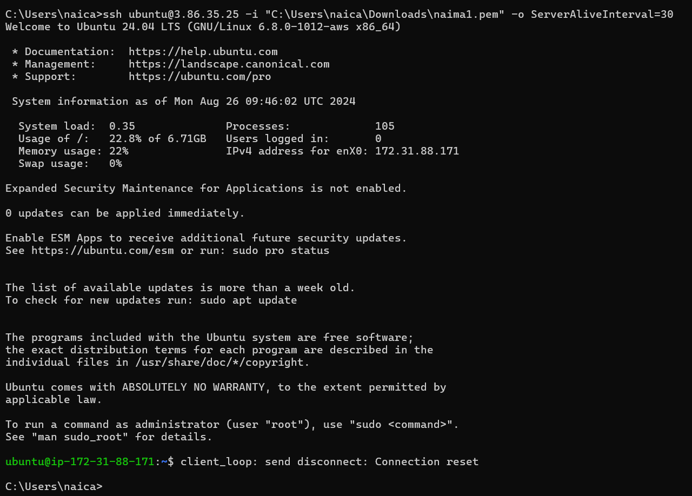
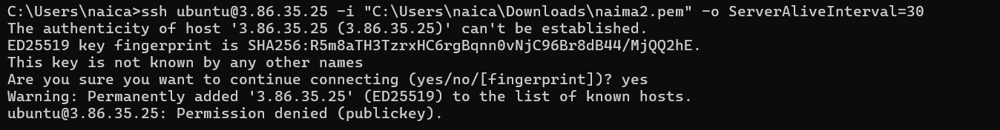
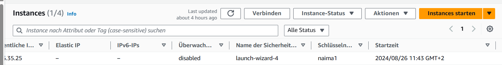

# Kompetenznachweis 02

Lab 4.1
HTML Page, inkl. URL

Liste der EC2-Instanzen

Details der Web Server-Instanz (öffentliche IP sichtbar)

Security-Group: Liste der Inbound-Regeln.

Lab 4.2
Liste der Buckets

HTML-Seite, inkl. URL

Liste der Dateien im Bucket

Eigenschaften von "Static website hosting"

JSON Datei mit der Bucket-Policy für den öffentlichen Zugriff
- Im Gitlab

Screenshot mit dem ssh-Befehl und des Resultats unter Verwendung des ersten Schlüssels

Screenshot mit dem ssh-Befehl und des Resultats unter Verwendung des zweiten Schlüssels

Screenshot der Instanz-Detail (oder Liste), so dass der verwendete Schlüssel sichtbar ist
