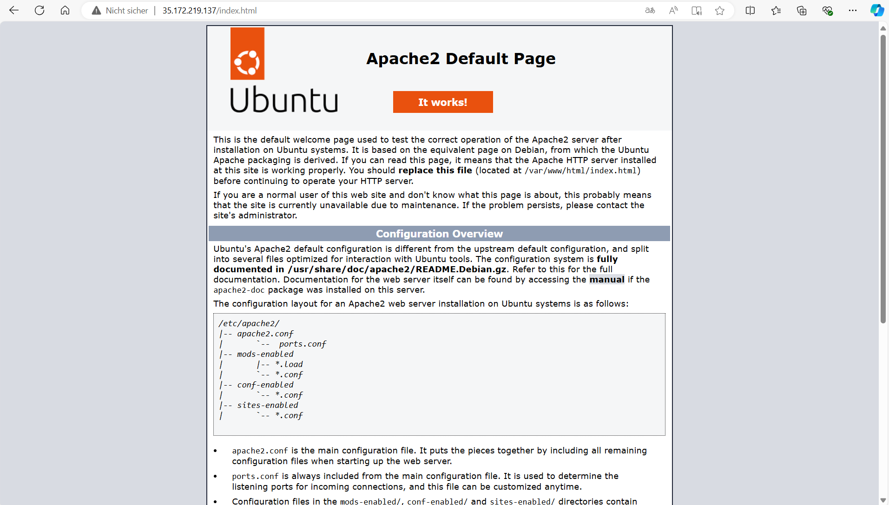
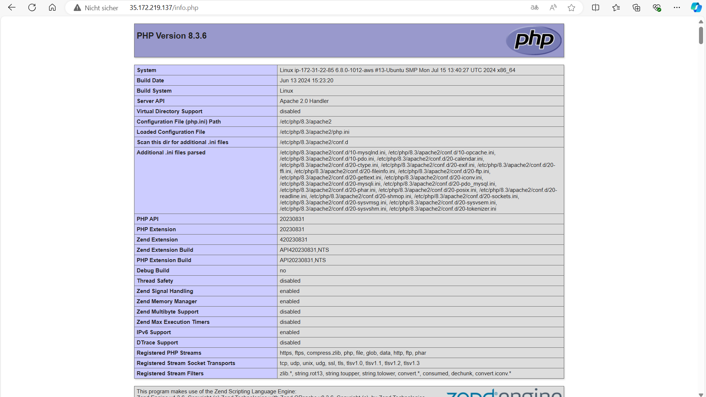
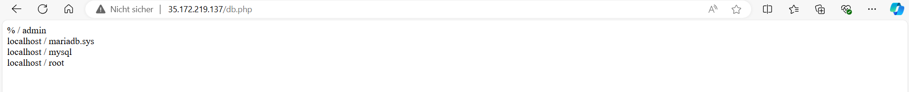
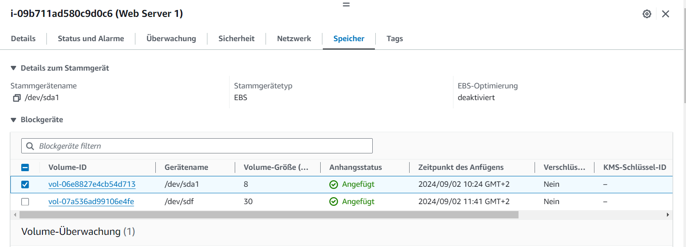

## Virtuelle Server

### A) Installation von Web- und Datenbankserver (60%)
Apache

Php

Datenbank

### B) Elastic Block Storage (EBS) hinzufügen. (40%)
Volume

Erklärung dazu für was eine zusätzliche virtuelle Disk verwendet werden könnte
1. **Datenspeicherung**: zusätzliche Speichereinheit, um mehr Daten zu speichern. Z.B für Datenbanken, Dateiserver.

2. **Backups**: Durch eine separate Disk können Backups unabhängig von der primären Disk erstellt und verwaltet werden, was das Risiko von Datenverlusten bei Systemfehlern reduziert.

3. **Datenbank-Partitionierung**: In grossen Datenbankanwendungen können zusätzliche virtuelle Disks verwendet werden, um Datenbanktabellen oder partitionen auf verschiedene physische Speichergeräte zu verteilen, um die Leistung zu steigern.

5. **Log-Dateien und Caching**: Eine zusätzliche virtuelle Disk kann zur Speicherung von Log-Dateien oder Cache-Daten verwendet werden.