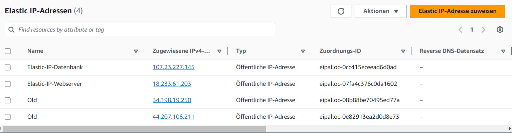

## Netzwerk/Sicherheit

### A) Diagramm erstellen (10%)

Was ist ein VPC:
VPC steht für Virtual Private Cloud und bezeichnet das eigene interne Netzwerk innerhalb des Anbieters. Ein Beispiel für solch ein VPC könnte 172.1.0.0/16 sein.

Was ist ein Subnetz:
Auf englisch Subnet bezeichnet Subnetz innerhalb der VPC. Man kann auch sagen es ist ein Subnetz von einem Subnetz. Alle Virtuellen Server werden systematisch oder von einem selber in Subnetzen platziert.

### B) Subnetz und private IP wählen (10%)
- Screenshot der Subnetzen, die die Namen zeigen

- Zwei definierte IPs für Web- und DB-Server/Instanz. Dazu braucht es keinen Screenshot,
einfach nur die beiden IPs als Text.
1. IP: 172.31.85.50
2. IP: 172.31.20.100

### C) Objekte und Instanzen erstellen (80%)

### Öffentliche, statische IP
