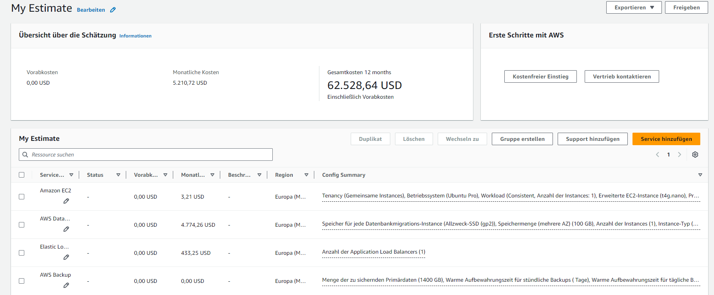

# Kostenrechnung erstellen 80%

## 1) Rehosting
### Ausgangslage 
- 1 Web Server mit 1 Core, 2 GB Speicher, 2 GB RAM, Ubuntu
- 1 DB Server mit 2 Cores, 100GB Speicher, 4 GB RAM, Ubuntu
- Load Balancer verwenden
- Backup Speicher für Datenbank
    - täglich für letzte 7 Tage
    - Wöchentlich für letzte 3 Monate
    - Monatlich für letzte 3 Monate

### Lösung
Schätzung:

Erklärung:
Wegen dem Geld habe ich mich entschieden Instanzen zu benutzen die geteilt werden. 
Für das Backup habe ich AWS Backup ausgewählt und es so konfiguriert wie vorgegeben.
Damit ich Geld spare, habe ich bei der E2 Instanz eine billigere Version gewählt.

## 2) Replattforming
### Ausgangslage 
- Heroku als Plattform
- Kosten für Entwicklung/Veränderung der Software werden ignoriert

### Lösung

## 3) Repurchasing
### Ausgangslage 
- Software ablösen mit Zoho CRM oder SalesForce Sales Cloud
- Firma 16 Mitarbeiter die CRM System benutzen werden

### Lösung

# Interpretation der Resultate 20%