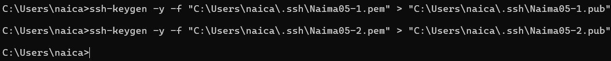
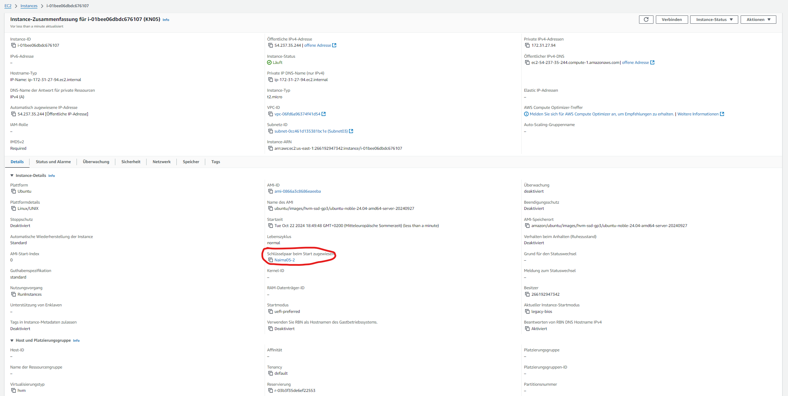
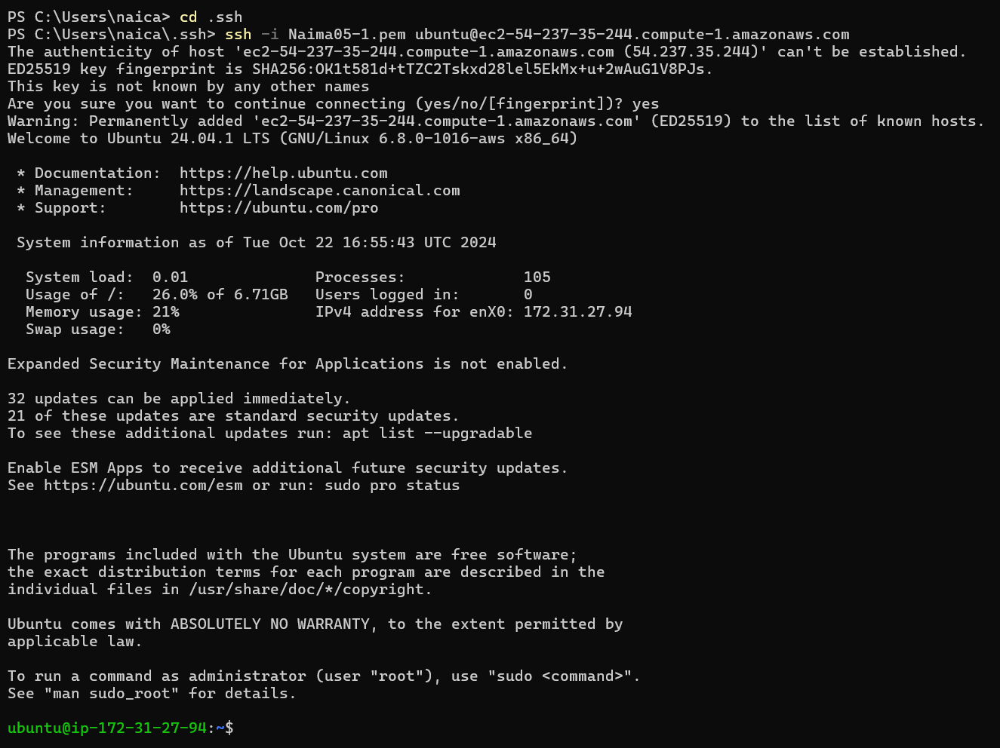
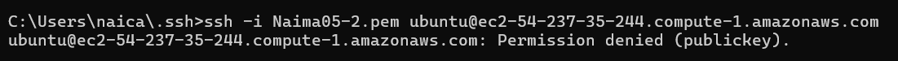
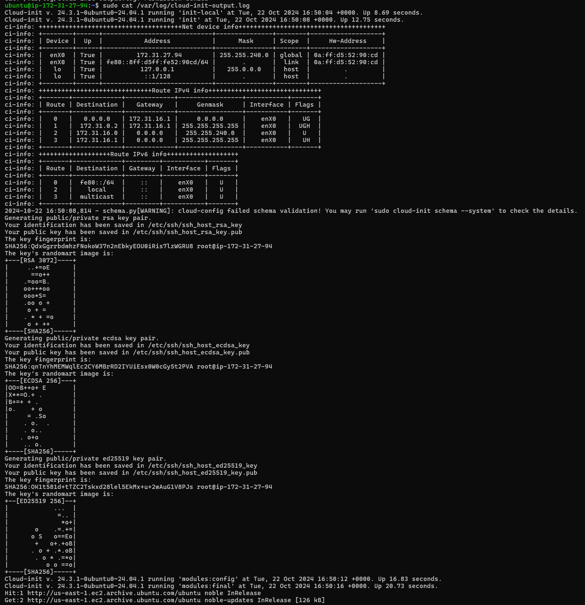

## Cloud-init und AWS

### A) Cloud-init Datei Verstehen (10%)
In seperatem Dokument (cloud-init-comments.yaml)

### B) SSH-Key und Cloud-init (15%)
Command für extrahierung:
```
ssh-keygen -y -f "C:\Users\naica\.ssh\Naima05-1.pem" > "C:\Users\naica\.ssh\Naima05-1.pub"
ssh-keygen -y -f "C:\Users\naica\.ssh\Naima05-2.pem" > "C:\Users\naica\.ssh\Naima05-2.pub"
```

Extrahierung Keys


Key konfiguration Instanz


1. Private Key
```
ssh -i Naima05-1.pem ubuntu@ec2-54-237-35-244.compute-1.amazonaws.com
```


2. Private Key
```
ssh -i Naima05-2.pem ubuntu@ec2-54-237-35-244.compute-1.amazonaws.com
```


Auszug cloud-init-log
```
 sudo cat /var/log/cloud-init-output.log
 ```


### C) Template (5%)


### D) Installation automatisieren (70%)