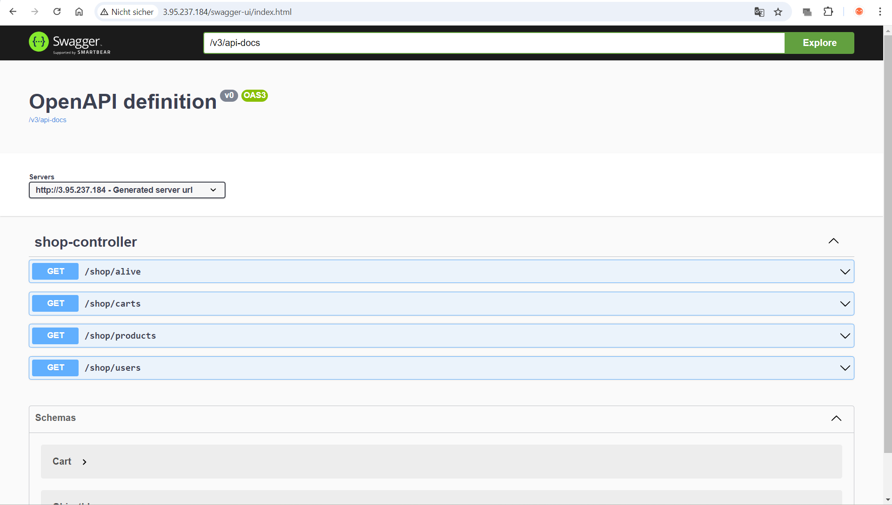
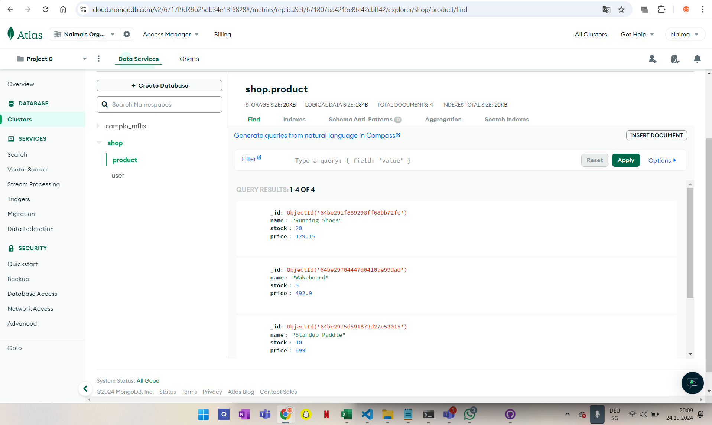
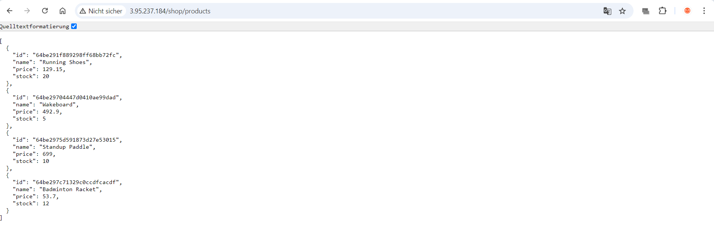
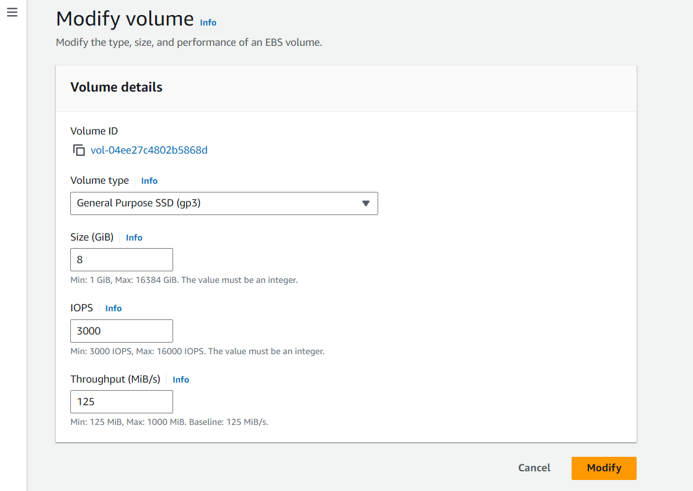
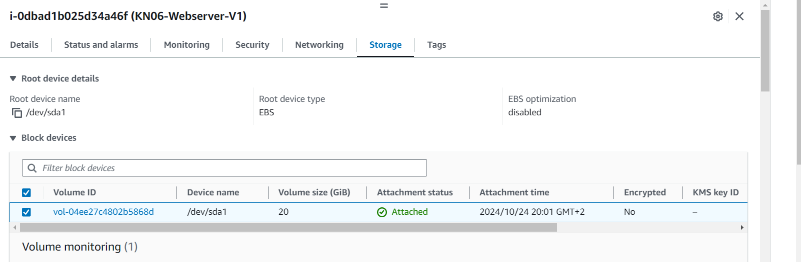
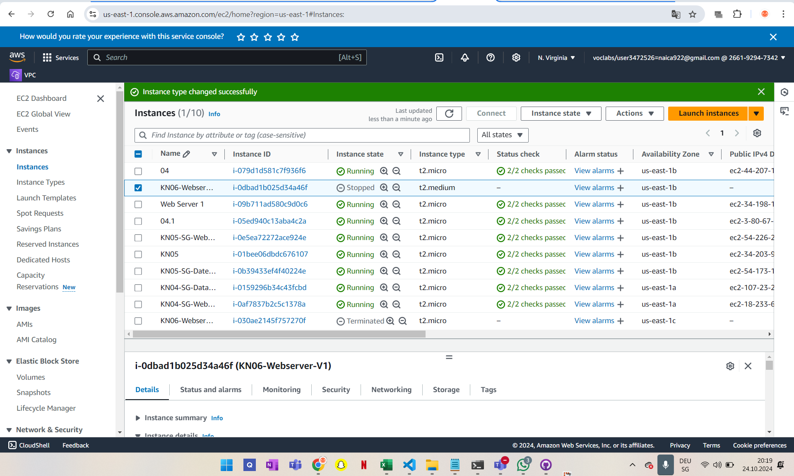
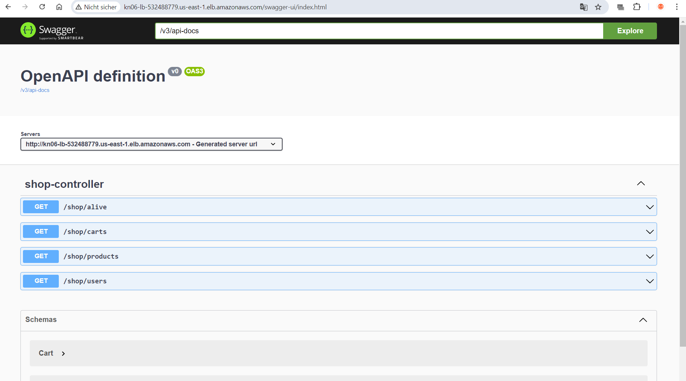
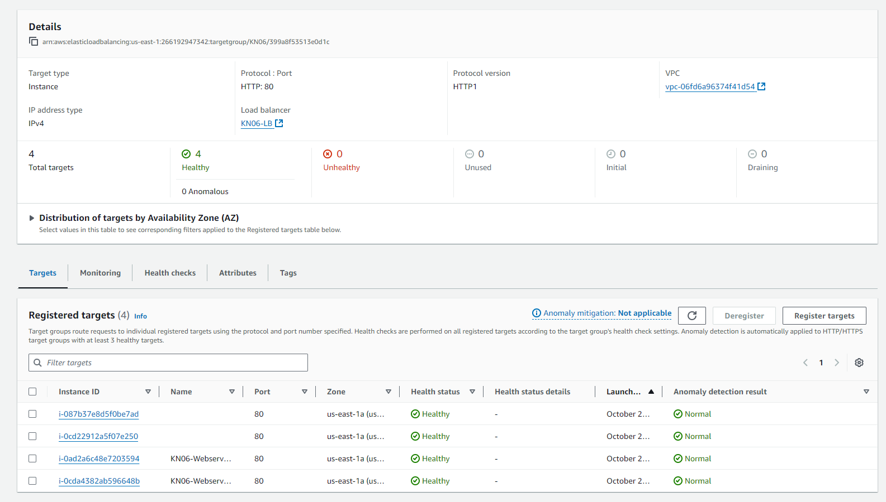
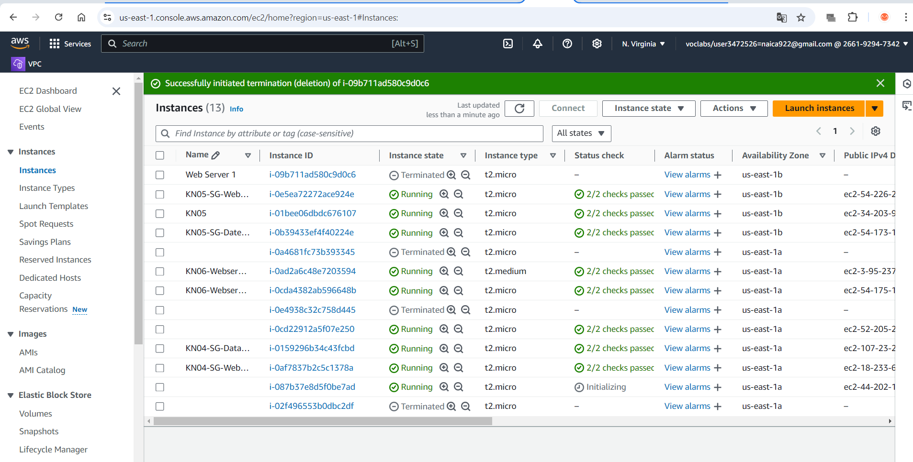

## Skalierung

### A) Installation App (50%)
Kurze Erklärung in eigenen Worten was ein Reverse Proxy ist:

Schauen Sie sich das Cloud-Init genau an. Welche(r) Teil(e) macht/machen hier überhaupt keinen Sinn in einer produktiven Umgebung?

Swagger

Shop Items

Endpoint

### B) Vertikale Skalierung  (10%)
Volume vor der Änderung

Volume nach der Änderung

Geht dies im laufenden Betrieb?
Ja

Schritte die notwendig waren:
..

Instanztyp Änderung

### C) Horizontale Skalierung (20%)
Wie müssten Sie den DNS konfigurieren, damit dies funktioniert?

Erklärung DNS

Screenshot Swagger-Aufruf über LoadBalancer URL

Seien Sie bereit Auskunft zu erteilen über ihr Vorgehen und die erstellten Objekte wie Load Balancer, Target Group, Health Check, IPs, Sicherheitsgruppen, Listener u. a.

### D) Auto Scaling (20%)
