## PAAS

### A) Datenbank im PAAS Modell (20%)
Screenshot MySqlWorkbench:
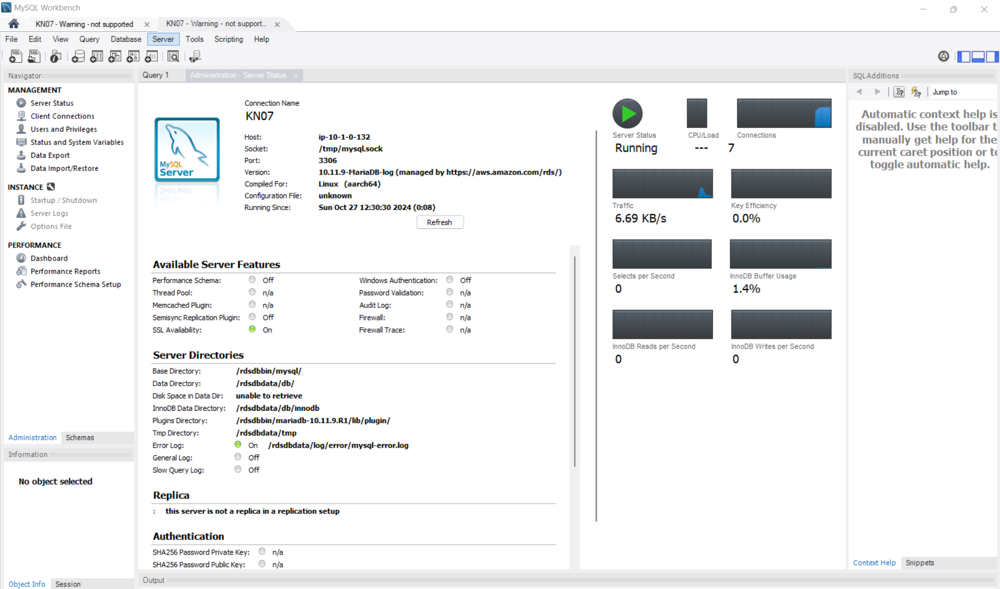

Erklären Sie wieso Sie besser einen PAAS oder SAAS Service verwenden anstatt eine eigene Datenbank zu installieren:

### B) PAAS Applikation erstellen (60%)
Screenshots für alle Bereiche auf allen Seiten:

Konfigurieren der Umgebung
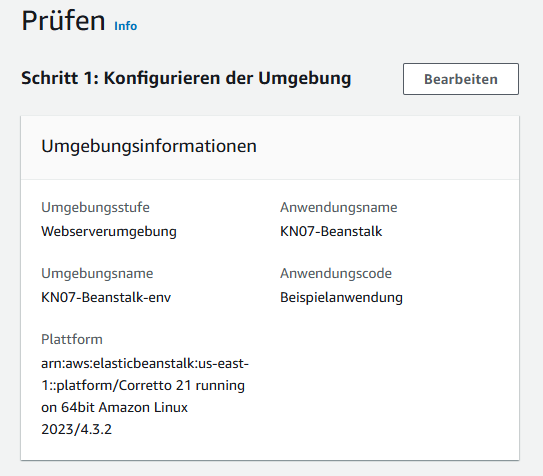

Konfigurieren des Servicezugriffs
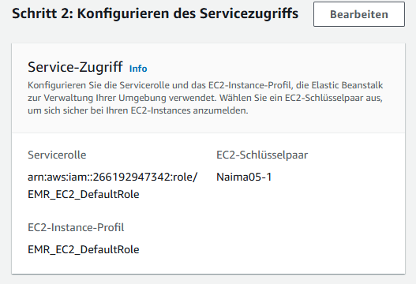

Einrichten von Netzwerk, Datenbank und Tags
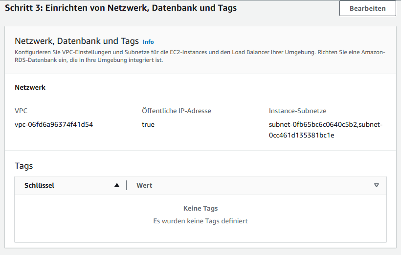

Konfigurieren des Instance-Datenverkehrs und der Skalierung
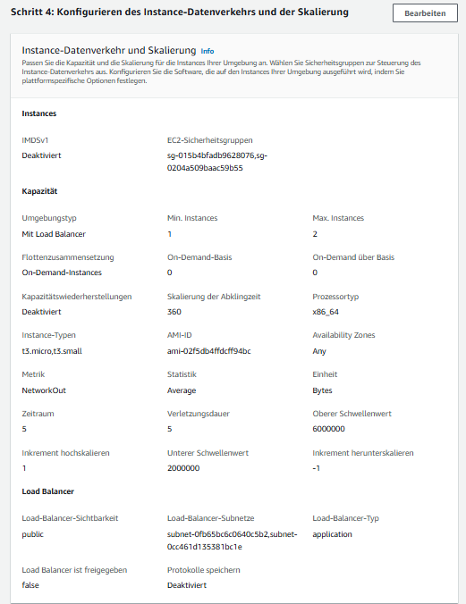

Konfigurieren von Updtaes, Überwachung und Protokollierung
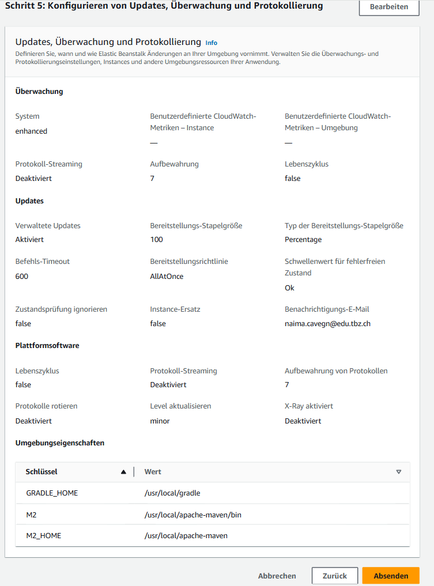

Erklärungen zur Auswahl für alle Bereiche:

### B) Erstellte Ressourcen/Objekte und CloudFormation (20%)
Erklärung Cloud Formation:

Screenshots EC2 Objekte und CloudFormation Ressourcen für PAAS Anwendung:

Cloud Formation
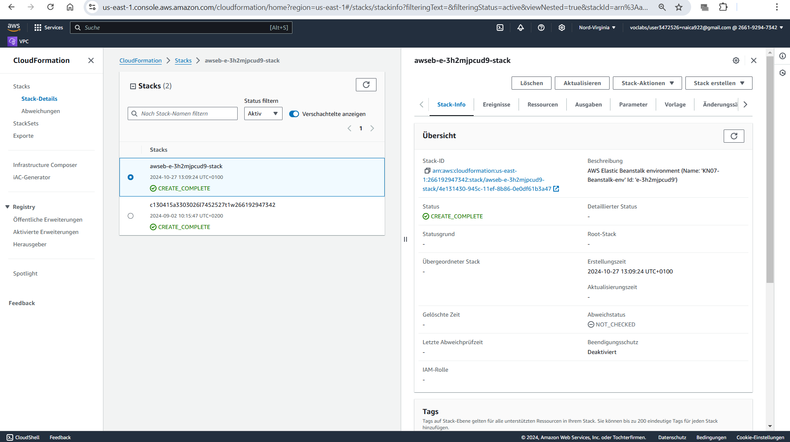

Instanz
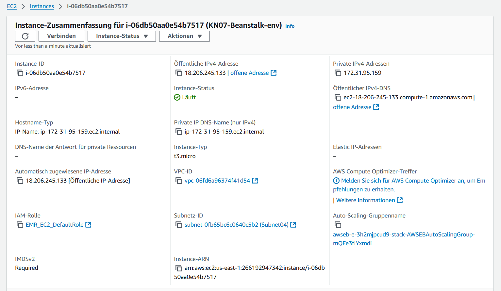
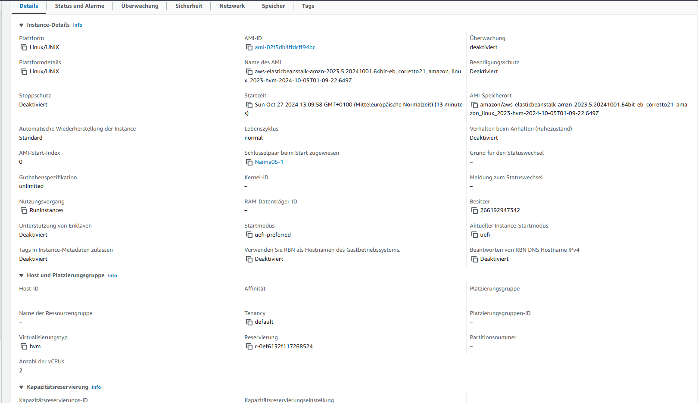

Auto Scaling
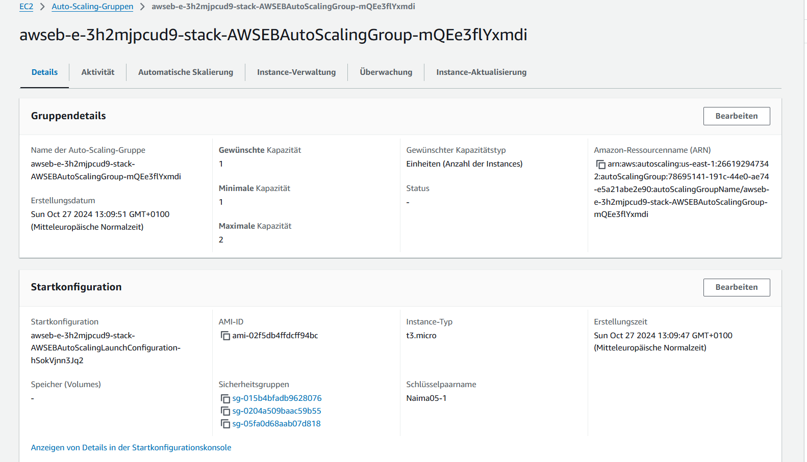

Load Balancer
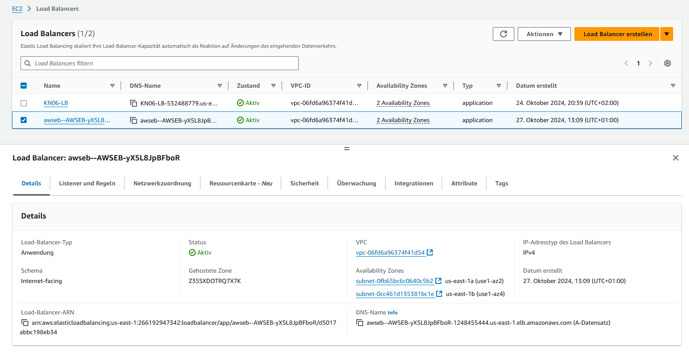

Stacks 
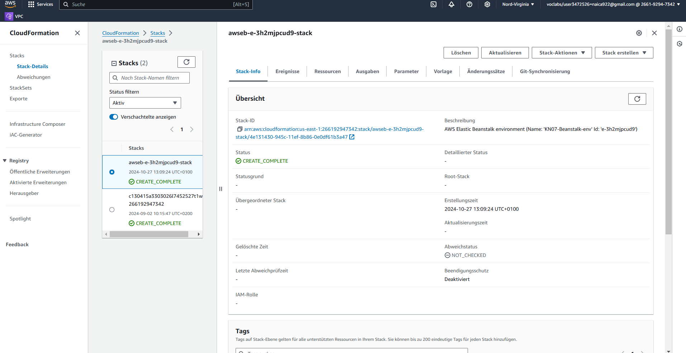

Target Group
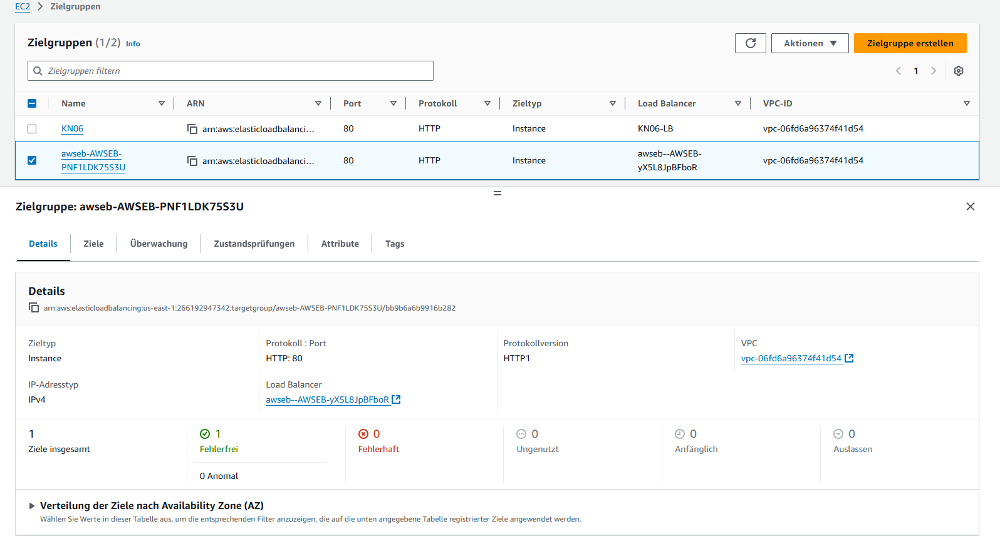

Erklärung CloudFormation. Unterschied Cloud-Init (beides automatisierungen?):
