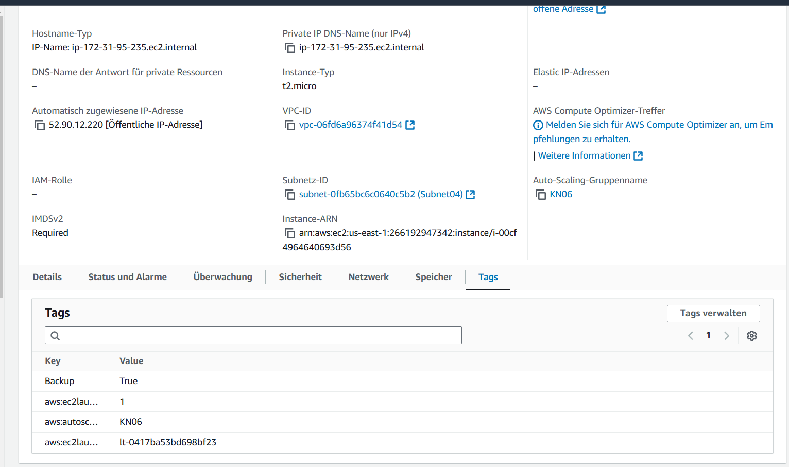

## FaaS und Backup

### A) Backup Skript (70%)
Screenshot Liste der erstellten Snapshots 
Snapshots backup 

Snapshots cleanup 

Screenshot Tags

### B) CRON-Joborkbench
Backup Zeitplan 
 
 

Cleanup Zeitplan 
 

Zeitpläne 
 