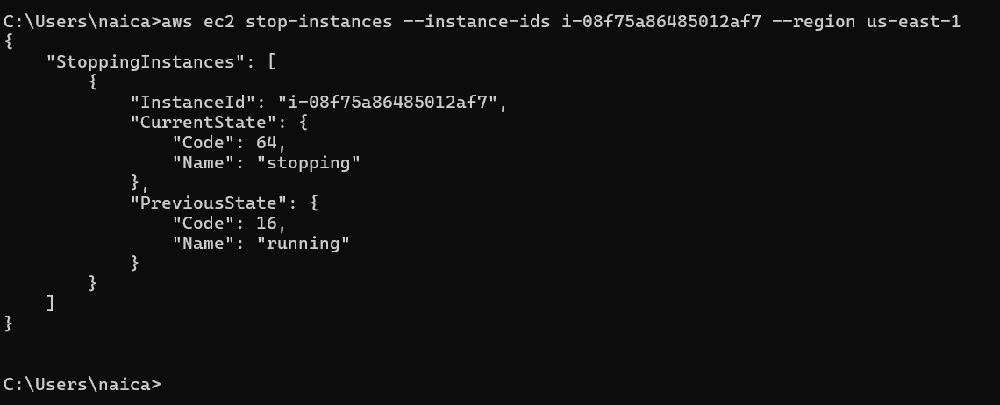
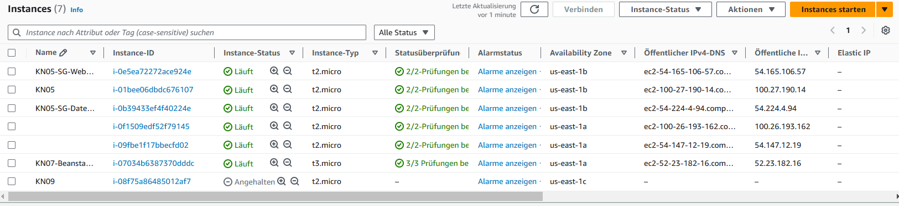
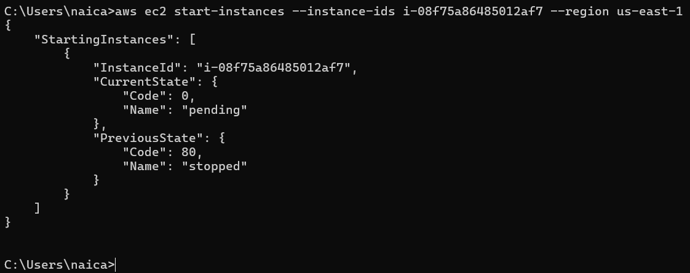
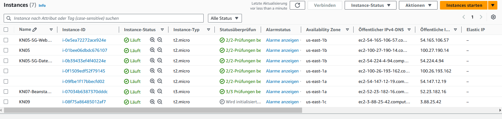

## Automation

### A) Automatisierung mit Command Line Interface (CLI) (30%)
```
aws ec2 stop-instances --instance-ids i-0i-07034b6387370dddc --region us-east-1
```



```
aws ec2 start-instances --instance-ids i-0i-07034b6387370dddc 
```



```
aws ec2 run-instances --image-id ami-0866a3c8686eaeeba --count 1 --instance-type t2.micro --key-name Naima05-1 --security-group-ids sg-0bc7797050fb52adc --subnet-id subnet-05dc92e79483a7158 --user-data (path)
```

### B) Terraform (70%)

### C) Beliebige Erweiterungen