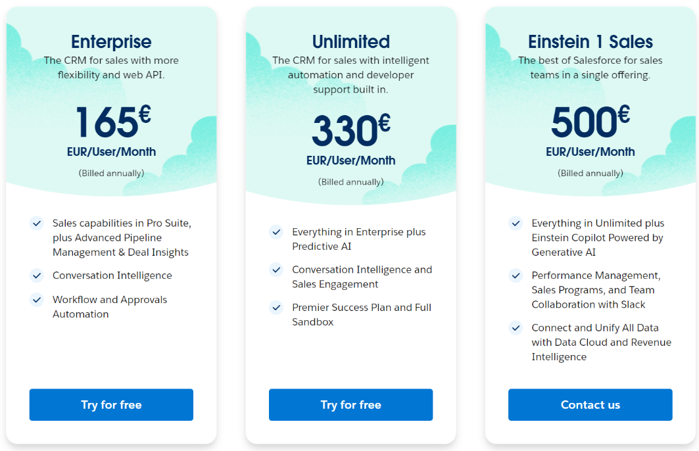

# Kostenrechnung erstellen 80%

## 1) Rehosting
### Ausgangslage 
- 1 Web Server mit 1 Core, 2 GB Speicher, 2 GB RAM, Ubuntu
- 1 DB Server mit 2 Cores, 100GB Speicher, 4 GB RAM, Ubuntu
- Load Balancer verwenden
- Backup Speicher für Datenbank
    - täglich für letzte 7 Tage
    - Wöchentlich für letzte 3 Monate
    - Monatlich für letzte 3 Monate

### Lösung
Schätzung:

Erklärung:
Wegen dem Geld habe ich mich entschieden Instanzen zu benutzen die geteilt werden. 
Für das Backup habe ich AWS Backup ausgewählt und es so konfiguriert wie vorgegeben.
Damit ich Geld spare, habe ich bei der E2 Instanz eine billigere Version gewählt.

## 2) Replattforming
### Ausgangslage 
- Heroku als Plattform
- Kosten für Entwicklung/Veränderung der Software werden ignoriert

### Lösung
Schätzung:

Erklärung:
Ich habe die gleichen Parameter wie bei Aufgabe 1 geachtet und mich schlussendlich für postgres als DB Instanz entschieden.
Zusätzlich habe ich den Performance M Dyno gewählt, da nur dieser der nötigen leistung entspricht.

## 3) Repurchasing
### Ausgangslage 
- Software ablösen mit Zoho CRM oder SalesForce Sales Cloud
- Firma 16 Mitarbeiter die CRM System benutzen werden

### Lösung
Schätzung:

Erklärung:
Ich nehme Zoho, weil es günstiger ist.
Für mich als nutzer macht es auch den Eindruck, als wäre es benutzerfreundlicher.

Ich nehme .. weil es am billgsten ist. Man muss jedoch den Aufwand beachten.

Gegenüberstellung der SaaS-Lösung zu IaaS und PaaS Lösungen von vorher. Welches wählen Sie und wieso? Was müsste man zusätzlich beachten?
SaaS (Zoho CRM oder Salesforce Sales Cloud):
Es muss keine Infrastruktur verwaltet werden. Wenn Man SaaS verwendet, muss man keine Infrastruktur verwalten was ein grosser Vorteil ist. CRM kann man direkt einsetzen ohne mehr zu konfigurieren. Updates, Wartung und Sicherheit werden vom Anbieter übernommen, was den Verwaltungsaufwand minimiert. Diese Lösung ist für Unternehmen sinnvoll, die sich auf ihre Kernkompetenzen konzentrieren möchten, anstatt sich mit IT-Infrastruktur oder Entwicklungsaufgaben zu beschäftigen.

IaaS (Rehosting auf AWS oder Azure):
Bei IaaS ist das Unternehmen für die Verwaltung der Infrastruktur verantwortlich, einschließlich der Wartung von Servern, Netzwerken, Speicher und virtuellen Maschinen. Dies bietet mehr Flexibilität und Kontrolle, erfordert jedoch ein höheres Maß an IT-Ressourcen und Expertise. Es wäre nicht ideal, ein CRM-System auf IaaS zu betreiben, da es zusätzlichen Verwaltungsaufwand verursacht und weniger effizient ist.

PaaS (Heroku):
PaaS ist eine bessere Wahl als IaaS, wenn es um die Entwicklung und Bereitstellung von eigenen Anwendungen geht, da es die Infrastruktur verwaltet und dem Entwicklungsteam mehr Freiheiten gibt. Allerdings ist eine CRM-Lösung als SaaS die naheliegendere Wahl, da es keinen Bedarf gibt, ein CRM von Grund auf neu zu entwickeln. Die Implementierung eines CRM als PaaS-Anwendung wäre unnötig komplex und ressourcenintensiv.

Zusammenfassung:
Die SaaS-Lösung ist die beste Wahl für das Unternehmen in Bezug auf das CRM. Sie erfordert weniger administrativen Aufwand, ist kosteneffizient und skalierbar. IaaS und PaaS wären hier überdimensioniert und unnötig kompliziert. Zusätzliche Punkte, die beachtet werden müssen, sind Datensicherheit und Datenschutz. Bei der Auswahl des SaaS-Anbieters sollte geprüft werden, wie mit sensiblen Kundendaten umgegangen wird und ob der Anbieter den Anforderungen der Datenschutzgrundverordnung (DSGVO) gerecht wird.

# Interpretation der Resultate 20%
wie stark unterscheiden sich die Angebote?
Die Angebote unterscheiden sich im Preis sehr, auf einigen Webseiten war es zusätzlich sehr mühsam 

Welches ist das billigste?

Wieso ist eines davon viel teurer? Ist es aber wirklich teurer?